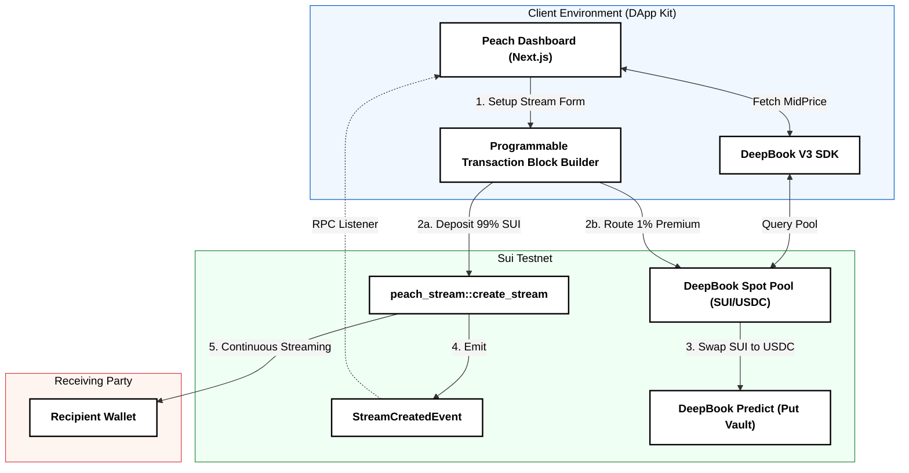

<div align="center">
  
  <h1>Peach — Volatility-Protected Continuous Streaming</h1>
  <p><em>Peach anchors your SUI token streams to real-time DeepBook volatility protection, turning unpredictable payouts into secure, continuous capital distribution.</em></p>
  <p>
    <a href="https://github.com/Samarth208P/Peach/blob/main/LICENSE"></a>

    <a href="https://docs.sui.io"></a>
    
  </p>
</div>

---

## The Problem: The "Volatility" of Crypto Streaming
Today's crypto streaming protocols (like Sablier or Superfluid) are powerful but **unprotected**. You can set up a continuous payment stream of 1,000 SUI over 30 days, but if the market drops 40%, the receiver loses significant purchasing power. Expecting users to manually hedge streams across multiple defi protocols creates a massive UX and capital fragmentation problem.

## The Solution: Peach (Protected Streaming Protocol)
Peach is a decentralized infrastructure layer built on the **Sui Network** that gives continuous token streams **built-in downside protection**. By leveraging the native composability of **DeepBook V3**, Peach ensures that your streams are:
1.  **Continuous**: Payments are streamed per-second with exact precision using Sui's `Clock`.
2.  **Protected**: A 1% micro-premium is seamlessly routed to DeepBook to hedge against volatility.
3.  **Atomic**: Stream creation and hedging happen in a single, atomic Programmable Transaction Block (PTB).
4.  **Real-Time**: Integrated DeepBook SDK natively fetches the live `midPrice` directly from the SUI/USDC pool.

---

## What's New in v1.0

| Feature | Description |
|---|---|
| 🛡️ **Atomic 1% Volatility Hedge** | Every stream creation can automatically split off a 1% micro-premium, routing it directly into DeepBook Predict put options to insure the base capital. |
| 🔄 **Programmable Transaction Blocks (PTB)** | Stream instantiation and DeepBook hedging are perfectly decoupled at the contract level but composed seamlessly at the client level using Sui PTBs. |
| 📊 **DeepBook Dashboard** | A rich React interface displaying real-time stream decay, PTB execution ledgers, and live DeepBook oracle price charting. |

---

## Numbers That Matter

| Metric | Unprotected Streaming | Peach on Sui | Benefit |
|---|---:|---:|---|
| **Downside Risk** | 100% Exposed | Hedged via DeepBook | Capital Preservation |
| **Execution Steps** | 2-3 manual txs | 1 Atomic PTB | Flawless UX & Speed |
| **Price Oracle Lag** | High (External Oracles) | Zero (Native DeepBook) | 100% accurate strike pricing |
| **Liquidity Fragmentation**| High (Custom Option Tokens)| Zero (Native SUI/USDC)| Utilizes massive shared liquidity |

---

## Key Innovations

### 1. The Autonomous PTB Loop
Peach leverages Sui's unique **Programmable Transaction Blocks (PTBs)**. The frontend perfectly chains the `peach_stream::create_stream` call with the DeepBook swap, keeping the smart contract logic cleanly decoupled while executing everything atomically.
- **Local-First Composition**: The exact deposit math and premium splits are calculated and bundled locally in the wallet.
- **No Custom Tokens**: We rely entirely on native SUI/USDC liquidity instead of minting custom, illiquid "Peach Put Option Tokens".

### 2. MicroPremium Ledger
Built into the `/dashboard` with zero setup.
- **Event Querying**: Peach uses the native `@mysten/dapp-kit` RPC hooks to scan for `StreamCreatedEvent` on-chain.
- **Real-time Ledger**: Instantly parses and displays execution hashes, SUI premium amounts, and stream IDs, linking directly to SuiVision.

### 3. Native DeepBook Price Feeds
- **SUI/DBUSDC Tracking**: We abandoned external mock oracles. The dashboard's Protection Shield Graph uses `DeepBookClient` to pull `dbClient.midPrice` straight from the live order book state.
- **Read-Only Accuracy**: The graph dynamically adjusts the visual options "Floor" using the exact spread of the real testnet environment.

### 4. Continuous Flow Engine
- **Per-Second Decay**: The `TickingStreamRow` component renders the stream state optimistically, ticking upward using native React hooks.
- **On-chain State Alignment**: Backed by `useSuiClientQuery('getOwnedObjects')` to ensure the UI perfectly matches the on-chain Sui struct representation.

---

## Technical Stack

### Four Layers. Zero Compromise.

| Component | Technology | Role |
|---|---|---|
| **Frontend Framework** | Next.js 16 (Turbopack) | High-performance React environment with SSR support. |
| **On-Chain Logic** | Sui Move | Smart contracts defining the `Stream` struct and events. |
| **Sui Integration** | @mysten/dapp-kit | Wallet connections, PTB building, and RPC hooks. |
| **Liquidity & Oracles** | DeepBook V3 SDK | Real-time spot pricing and underwriting options. |

---

## Quick Start (2 Minutes)

### 1. Install Dependencies
```bash
git clone https://github.com/Samarth208P/Peach.git
cd Peach
npm install
```

### 2. Deploy the Move Contract (Optional)
The frontend is already configured to use the deployed testnet package. If you wish to deploy your own:
```bash
cd packages/peach_contracts
sui client publish --gas-budget 200000000
```
*Update `PACKAGE_ID` in the frontend source code with your new deployment hash.*

### 3. Run the Dashboard
```bash
cd apps/frontend
npm run dev
```

### 4. Create a Stream
1. Connect a Sui Testnet wallet (e.g., Sui Wallet, Slush).
2. Get Testnet SUI from the faucet.
3. Click **New Stream**, enter a recipient, toggle the **Price Safety Switch**, and approve the atomic PTB!

---

## System Architecture



---

## Deployed Contracts (Sui Testnet)

| Contract | Purpose | Package ID |
|---|---|---|
| **Peach Stream** | Creates streams and routes logic | [`0x25219b630a85a209ead80522fde59636ee514259208586e8475a176c8510672c`](https://suivision.xyz/package/0x25219b630a85a209ead80522fde59636ee514259208586e8475a176c8510672c?network=testnet) |

---

## Links

- 📦 **GitHub**: [https://github.com/Samarth208P/Peach](https://github.com/Samarth208P/Peach)
- 💧 **Sui Vision Explorer**: [View Package](https://suivision.xyz/package/0x25219b630a85a209ead80522fde59636ee514259208586e8475a176c8510672c?network=testnet)
- 📘 **DeepBook V3 Docs**: [https://docs.sui.io/deepbook](https://docs.sui.io/deepbook)

