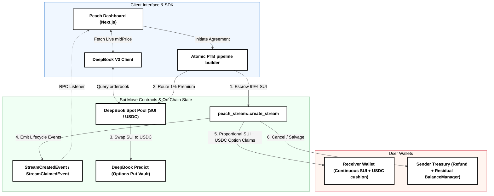

<div align="center">
  
  <h1>Peach — Volatility-Protected Continuous Payment Streaming</h1>
  <p><em>Peach anchors your SUI token streams to real-time DeepBook volatility protection, turning unpredictable payouts into secure, continuous capital distribution.</em></p>
  <p>
    <a href="https://github.com/Samarth208P/Peach/blob/main/LICENSE"></a>
    <a href="https://docs.sui.io"></a>
    
  </p>
</div>

---

## 🍑 The Problem: The Volatility of Crypto Streaming
Traditional cryptocurrency streaming protocols (e.g., Sablier, Superfluid) are entirely passive. Setting up a continuous payment stream of native, volatile assets (like SUI) for payroll or grants exposes both the sender and recipient to severe market risk. If SUI suffers a 35% mid-month correction:
* **The Recipient** loses substantial purchasing power, struggling to cover fixed fiat liabilities (like salaries or server costs).
* ** treasury teams** cannot hedge efficiently without maintaining 24/7 manual oversight, incurring heavy slippage and fragmented capital across decentralized exchanges.

## 🛡️ The Solution: Peach (Protected Streaming Protocol)
Peach is a decentralized risk-management payroll and grant-streaming protocol built natively on the **Sui Network**. It integrates directly with **DeepBook V3 Spot & Predict CLOB** architectures to provide automated, continuous downside volatility protection.

### How It Works:
1. **The 99/1 Split**: When a stream is created, the system splits the capital:
   * **99%** of the SUI principal is locked inside the continuous time-decay streaming escrow.
   * **1%** is routed as an insurance premium to purchase downside protection.
2. **Atomic PTB Pipeline**: A single, atomic Programmable Transaction Block (PTB) executes the entire setup on-chain:
   * Performs a Spot Swap (SUI → USDC) to get the exact premium value in stable collateral.
   * Mints an at-the-money downside put option on **DeepBook V3 Predict** using the USDC premium.
   * Binds the option position's lifecycle metadata directly within the `PeachStream` shared state.
3. **Automated Settlement & Payout**: During stream claims, the contract fetches real-time spot prices from DeepBook's native `OracleSVI`. If the asset price drops below the locked strike floor, the option is programmatically exercised, and the USDC payout cushion is pushed straight to the recipient along with their unlocked SUI principal.

---

## ⚡ Mathematical Invariant & Payoff Profile

Let $V_{\text{target}}$ represent the stream principal, and $\alpha = 0.01$ (1%) be the premium. Peach ensures a downside floor on the net purchasing power delivered to the recipient:

| Market Trend | Macro Probability | Spot Shift | Raw Stream Value | DeepBook Predict Option Payout | Net Payout (USD equivalent) |
|:---|:---:|:---:|:---:|:---:|:---|
| **Severe Downturn** | 25% | -40% | $30,000 | +$19,500 | **$49,500** (99% protected) |
| **Stable Flat** | 50% | 0% | $50,000 | $0 | **$49,500** (Premium safely costed) |
| **Aggressive Bull** | 25% | +40% | $70,000 | $0 | **$69,300** (Full upside captured) |

---

## 🛠️ Key Architectural Patterns (Move & CLOB)

Peach implements advanced design patterns to bridge continuous streaming logic with discrete, order-book-based financial derivatives:

### 1. Hedge Rollover Accumulator
Central Limit Order Books (CLOBs) impose strict minimum trade lot sizes (`min_lot_size`). If a recipient claims funds on a per-second stream, the proportional 1% option protection slice for that block is typically below the minimum trade threshold.
* **The Bug**: Executing an order book exercise on micro-claims would revert the entire transaction due to lot size limits.
* **The Fix**: Peach introduces `unexercised_hedge_volume`, a local dust reservoir. Sub-threshold option volumes accumulate on every claim and roll over. When the buffer crosses the `min_lot_size` limit, the contract atomically executes the exercise, protecting gas and avoiding transaction reverts.

### 2. Linear Ownership Transfer (The Salvage Move)
In Sui Move, objects holding assets or structures that lack the `drop` ability (such as DeepBook's `BalanceManager` position ledger) cannot be deleted. Destroying a cancelled stream would trigger a compiler-time error.
* **The Fix**: During early stream cancellations (`cancel_stream`), the shared `PeachStream` object is destructed by value. Rather than trying to delete the active options ledger, the contract returns the remaining unstreamed SUI principal to the sender, settles the receiver's unlocked assets, and **transfers ownership of the residual `BalanceManager` containing the remaining option contracts back to the sender treasury**. This allows corporate treasurers to sell the options or hold them independently, avoiding capital waste.

---

## 📊 Technical Stack

| Component | Technology | Role |
| :--- | :--- | :--- |
| **Frontend Framework** | Next.js 16 (Turbopack / Webpack) | Ultra-responsive B2B dashboard and interactive interface. |
| **On-Chain Logic** | Sui Move | Smart contracts defining `PeachStream` objects, event models, and settlement. |
| **Integrations** | @mysten/dapp-kit, @mysten/sui | Wallet connection, RPC queries, and PTB builder pipelines. |
| **Risk & Volatility** | DeepBook V3 SDK | Real-time SUI/USDC Spot Pools, Predict Option Pools, & OracleSVI price tracking. |

---

## 🔮 System Data Flow



---

## 📦 Move Contract Interface Walkthrough

Below are the core architectures and entry points implemented in `packages/peach_contracts/sources/peach_stream.move`.

### 1. State Struct (`PeachStream`)
```rust
public struct PeachStream<phantom USDC> has key {
    id: UID,
    sender: address,
    receiver: address,
    total_amount: u64,               // Derived 99% SUI base volume
    withdrawn: u64,                  // Total SUI claimed by receiver so far
    balance: Balance<SUI>,           // Escrowed SUI asset pool
    start_time: u64,                 // Millisecond timestamp
    end_time: u64,                   // Millisecond timestamp
    balance_manager: BalanceManager, // Embedded child ledger owning the active options
    strike_price: u64,               // Price floor locked at genesis
    option_expiry: u64,              // Expiry timestamp matching end_time
    unexercised_hedge_volume: u64,   // Dust accumulator reservoir
}
```

### 2. Stream Genesis (`create_stream`)
```rust
public entry fun create_stream<USDC>(
    receiver: address,
    start_time: u64,
    end_time: u64,
    strike_price: u64,
    stream_coin: Coin<SUI>,
    premium_coin: Coin<USDC>,
    predict_pool: &mut PredictPool,
    ctx: &mut TxContext
)
```

### 3. Stream Claim & Settlement (`claim_stream`)
```rust
public entry fun claim_stream<USDC>(
    stream: &mut PeachStream<USDC>,
    predict_pool: &mut PredictPool,
    oracle_svi: &OracleSVI,
    clock: &Clock,
    ctx: &mut TxContext
)
```

### 4. Stream Cancellation & Unwinding (`cancel_stream`)
```rust
public entry fun cancel_stream<USDC>(
    stream: PeachStream<USDC>,
    predict_pool: &mut PredictPool,
    oracle_svi: &OracleSVI,
    clock: &Clock,
    ctx: &mut TxContext
)
```

---

## 🚀 Deployed Contracts & Assets (Sui Testnet)

| Contract / Object | Type | Address |
| :--- | :--- | :--- |
| **Move Package ID** | Contract Package | [`0x23b6f040c2c08d3d4b692d48d2c1f9826148a57893098f7d143458f2953763bc`](https://suivision.xyz/package/0x23b6f040c2c08d3d4b692d48d2c1f9826148a57893098f7d143458f2953763bc?network=testnet) |
| **PredictPool** | Options Predict Pool | `0x4c926249761de71fae516c0305481da3aa38f9439b1f27c933b8bbc613352243` |
| **OracleSVI** | Black-Scholes Pricing Oracle | `0xb79189c195876000b9de26caf42279766f3ab9c7b1b5c4764887e04b406b5b06` |

---

## 📈 Monetization & Yield Generation
Peach is built to sustain long-term business models beyond B2B utility:
1. **DeepBook V3 Rebates**: Earns developers volume-based rebates from transactions routed directly into the DeepBook Spot and Predict pools.
2. **Float Yield Staking**: Deploys a percentage of the unstreamed escrow balance into decentralized money markets (e.g. Scallop, Navi), charging a 10% performance fee on the interest generated.
3. **Protection Spread**: Charges a flat 2% performance fee strictly on the options payouts received during downside protection claims.

---

## 💻 Quick Start & Setup

### 1. Clone & Install Dependencies
```bash
git clone https://github.com/Samarth208P/Peach.git
cd Peach
npm install
```

### 2. Run Contracts Environment
```bash
cd packages/peach_contracts
# Build contracts
sui move build
# Run contract unit tests
sui move test
```

### 3. Launch Frontend Client
Ensure you have Node.js >= 22.
```bash
cd ../../apps/frontend
# Run local Next.js client
npm run dev
```

---

## 🔗 Links & Resources
* 📦 **GitHub Repository**: [https://github.com/Samarth208P/Peach](https://github.com/Samarth208P/Peach)
* 📘 **DeepBook V3 Documentation**: [Sui Developer Docs](https://docs.sui.io/deepbook)
* 🌐 **Sui Explorer Package Tracker**: [SuiVision Package Detail](https://suivision.xyz/package/0x23b6f040c2c08d3d4b692d48d2c1f9826148a57893098f7d143458f2953763bc?network=testnet)
